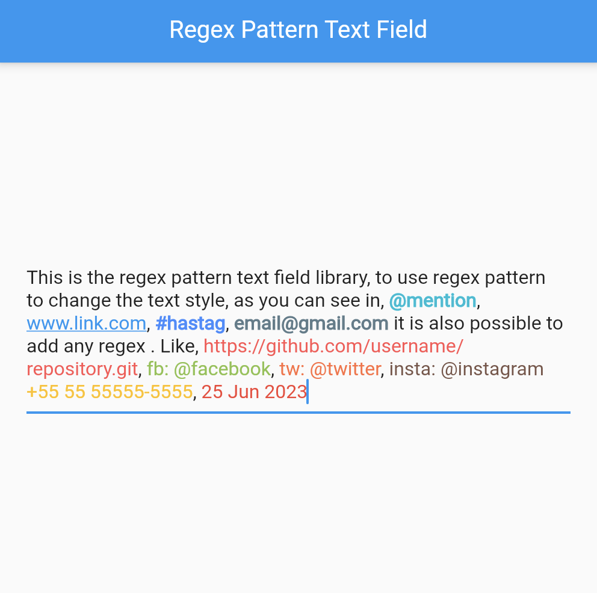

# Regex Pattern Text Field

The `RegexPatternTextField` is a powerful Flutter widget that simplifies working with pattern matching and applying styles to matched text in a text field. This widget is especially useful for highlighting patterns like URLs, emails, hashtags, mentions, and more.



---

## Features

- **Pattern Matching**: Recognize and style text based on predefined or custom regex patterns.
- **Customizable Styles**: Apply unique text styles for each matched pattern.
- **Real-Time Updates**: Monitor and react to changes in the input dynamically.
- **Extensibility**: Easily add new regex patterns and their corresponding styles.

---

## Getting Started

### Installation

Add the package to your `pubspec.yaml` file:

```yaml
dependencies:
  regex_pattern_text_field: ^1.0.0
```

Run the following command to fetch the package:

```bash
flutter pub get
```

### Import the Package

```dart
import 'package:regex_pattern_text_field/regex_pattern_text_field.dart';
```

---

## How to Use

### Basic Example

Replace your standard `TextField` with the `RegexPatternTextField`. Define patterns and styles using `RegexPatternTextStyle`.

```dart
RegexPatternTextField(
  maxLines: null,
  regexPatternController: _controller,
  onChanged: (matches, text) {
    print("Text changed: $text");
  },
  onSubmitted: (matches, text) {
    print("Text submitted: $text");
  },
  defaultRegexPatternStyles: true,
  regexPatternStyles: [
    RegexPatternTextStyle(
      type: "email",
      regexPattern: r"[a-zA-Z0-9._%+-]+@[a-zA-Z0-9.-]+\.[a-zA-Z]{2,}",
      textStyle: const TextStyle(color: Colors.blue, fontWeight: FontWeight.bold),
    ),
    RegexPatternTextStyle(
      type: "hashtag",
      regexPattern: r"#\w+",
      textStyle: const TextStyle(color: Colors.green, fontStyle: FontStyle.italic),
    ),
  ],
  onMatch: (model) {
    print("Matched pattern: ${model.type}, Text: ${model.text}");
  },
  onNonMatch: (text) {
    print("No match for: $text");
  },
);
```

---

## Callbacks

### `onMatch`
Triggered when a regex pattern matches a part of the text. Provides detailed information about the match.

### `onNonMatch`
Called when no pattern matches the text.

### `onChanged`
Executes every time the text changes, providing real-time feedback.

### `onSubmitted`
Invoked when the user submits the text (e.g., pressing Enter).

---

## Customization

### Add New Patterns

Define additional patterns dynamically:

```dart
RegexPatternTextStyle(
  type: "customPattern",
  regexPattern: r"\d{4}-\d{2}-\d{2}", // Matches dates in YYYY-MM-DD format
  textStyle: const TextStyle(color: Colors.orange, fontWeight: FontWeight.bold),
);
```

### Combine Default and Custom Styles

Enable default styles while adding custom ones:

```dart
RegexPatternTextField(
  defaultRegexPatternStyles: true,
  regexPatternStyles: [
    // Add custom styles here
  ],
);
```

---

## Example Application

Here's a complete example:

```dart
import 'package:flutter/material.dart';
import 'package:regex_pattern_text_field/regex_pattern_text_field.dart';

void main() {
  runApp(const MyApp());
}

class MyApp extends StatelessWidget {
  const MyApp({super.key});

  @override
  Widget build(BuildContext context) {
    return const MaterialApp(
      home: RegexPatternDemo(),
    );
  }
}

class RegexPatternDemo extends StatefulWidget {
  const RegexPatternDemo({Key? key}) : super(key: key);

  @override
  State<RegexPatternDemo> createState() => _RegexPatternDemoState();
}

class _RegexPatternDemoState extends State<RegexPatternDemo> {
  final RegexPatternTextEditingController _controller = RegexPatternTextEditingController();
  List<RegexPatternMatched> matches = [];

  @override
  void initState() {
    super.initState();
    _controller.addListener(() {
      setState(() {
        matches = _controller.regexPatternMatchedList;
      });
    });
  }

  @override
  Widget build(BuildContext context) {
    return Scaffold(
      appBar: AppBar(
        title: const Text('Regex Pattern Text Field'),
      ),
      body: Column(
        children: [
          Padding(
            padding: const EdgeInsets.all(16.0),
            child: RegexPatternTextField(
              maxLines: null,
              regexPatternController: _controller,
              onChanged: (matches, text) => debugPrint("Text changed: $text"),
              regexPatternStyles: [
                RegexPatternTextStyle(
                  type: "email",
                  regexPattern: r"[a-zA-Z0-9._%+-]+@[a-zA-Z0-9.-]+\.[a-zA-Z]{2,}",
                  textStyle: const TextStyle(color: Colors.blue),
                ),
              ],
            ),
          ),
          Expanded(
            child: ListView.builder(
              itemCount: matches.length,
              itemBuilder: (context, index) {
                final match = matches[index];
                return ListTile(
                  title: Text("Matched Text: ${match.text}"),
                  subtitle: Text("Type: ${match.type}"),
                );
              },
            ),
          ),
        ],
      ),
    );
  }
}
```

---

## Contributions

Contributions are welcome! Feel free to open issues or submit pull requests on [GitHub](https://github.com/pablostefan/regex_pattern_text_field).

---

## License

This project is licensed under the MIT License. See the `LICENSE` file for details.
