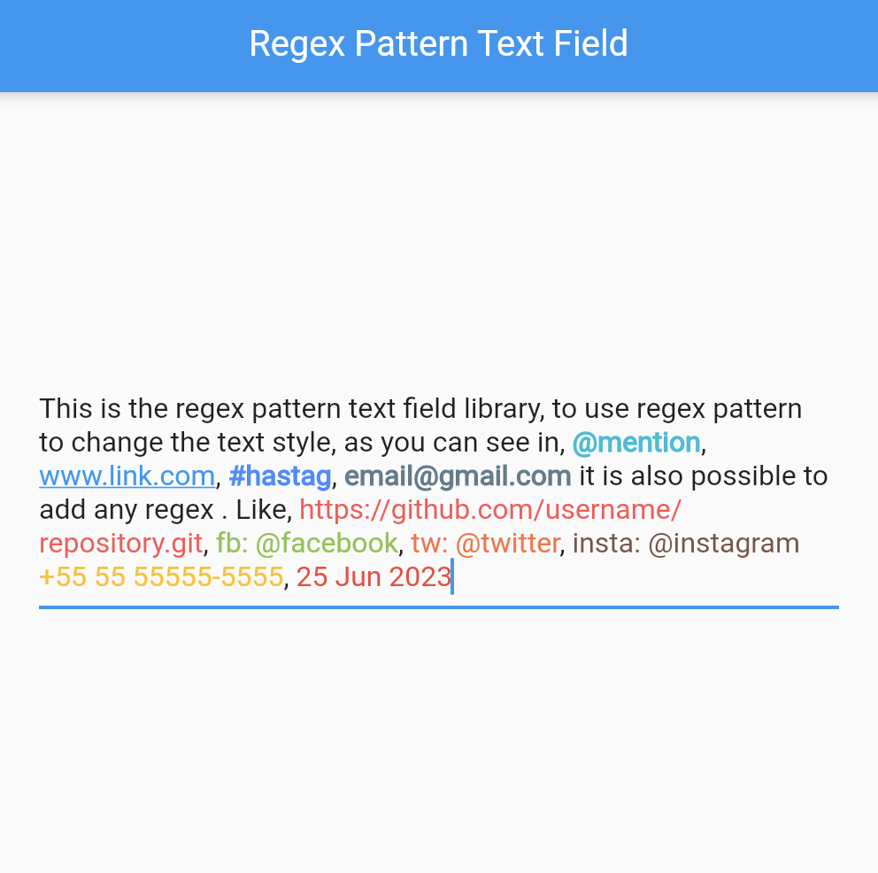

# Regex Pattern Text Field

<p align="left">
  <a href="https://github.com/pablostefan/regex_pattern_text_field/actions/workflows/ci.yml"></a>
  <a href="https://pub.dev/packages/regex_pattern_text_field"></a>
  <a href="https://pub.dev/packages/regex_pattern_text_field"></a>
  <a href="https://pub.dev/packages/regex_pattern_text_field"></a>
  <a href="LICENSE"></a>
</p>

Highlight regex matches while the user types, using a widget that feels like a regular `TextField`.

`RegexPatternTextField` is designed for mentions, hashtags, URLs, emails, custom tokens, and any pattern-driven input experience.

Destaque regex em tempo real enquanto o usuário digita, usando um widget com experiência de `TextField` nativo.

`RegexPatternTextField` foi criado para @mentions, #hashtags, URLs, e-mails, tokens customizados e qualquer fluxo baseado em padrões.



## Table of Contents

- [English](#english)
- [Português (Brasil)](#português-brasil)

## English

### Highlights

- Real-time highlight with regex pattern styles.
- Typed metadata per pattern using `RegexPatternTextStyle<T>`.
- Match callbacks for domain behavior (mentions, validation, chips, automation).
- Built-in default pattern set + custom patterns.
- Drop-in usage with familiar Flutter `TextField` API.

### Compatibility

- Dart: `>=3.8.0 <4.0.0`
- Flutter: `>=3.35.0`

### Installation

```yaml
dependencies:
  regex_pattern_text_field: ^1.1.0
```

```bash
flutter pub get
```

### Import

```dart
import 'package:regex_pattern_text_field/regex_pattern_text_field.dart';
```

### Quick Start

```dart
final controller = RegexPatternTextEditingController();

RegexPatternTextField(
  regexPatternController: controller,
  maxLines: null,
  defaultRegexPatternStyles: true,
  regexPatternStyles: const [
    RegexPatternTextStyle<String>(
      type: 'custom',
      regexPattern: r'%+([a-zA-Z]+)',
      textStyle: TextStyle(color: Colors.pink),
    ),
  ],
  onMatch: (model) {
    debugPrint('match: ${model.text} | type: ${model.type}');
  },
  onNonMatch: (token) {
    debugPrint('non-match token: $token');
  },
  onChanged: (matches, text) {
    debugPrint('text: ${text.length} chars | matches: ${matches.length}');
  },
);
```

### Main API

| API | Description |
|---|---|
| `RegexPatternTextField` | Text input with inline regex highlighting |
| `RegexPatternTextEditingController` | Controller exposing `regexPatternMatchedList` |
| `RegexPatternTextStyle<T>` | Pattern + style + typed metadata |
| `RegexPatternMatched<T>` | Match payload from callbacks |

#### `RegexPatternTextStyle<T>`

```dart
const RegexPatternTextStyle<String>(
  type: 'ticket',
  regexPattern: r'#[0-9]+',
  textStyle: TextStyle(fontWeight: FontWeight.bold),
  caseSensitive: false,
  multiLine: true,
)
```

#### `RegexPatternMatched<T>` fields

- `text`: matched text
- `start`: start index
- `end`: end index
- `pattern`: regex used by the matcher
- `type`: typed metadata from your style

### Default Pattern Set

When `defaultRegexPatternStyles` is `true`, the package includes:

- `email`
- `url`
- `hashtag`
- `mention`

You can combine defaults and your custom styles in the same field.

### Callback Signatures

- `onMatch(RegexPatternMatched<Object?> model)`
- `onNonMatch(String token)`
- `onChanged(List<RegexPatternMatched<Object?>> matches, String text)`
- `onSubmitted(List<RegexPatternMatched<Object?>> matches, String text)`

### Example App

```bash
cd example
flutter run
```

The demo includes:

- typed custom patterns
- default + custom pattern composition
- real-time match list and callback state

### Testing

```bash
flutter test
```

The suite covers controller behavior, helper matching rules, and widget callback flow.

### Contributing

Issues and pull requests are welcome:

- https://github.com/pablostefan/regex_pattern_text_field

### License

MIT. See [LICENSE](LICENSE).

## Português (Brasil)

### Destaques

- Destaque em tempo real com estilos por regex.
- Metadados tipados por padrão com `RegexPatternTextStyle<T>`.
- Callbacks de match para regras de domínio (mentions, validações, chips, automações).
- Conjunto padrão de padrões + padrões customizados.
- Uso simples, mantendo a experiência de um `TextField` do Flutter.

### Compatibilidade

- Dart: `>=3.8.0 <4.0.0`
- Flutter: `>=3.35.0`

### Instalação

```yaml
dependencies:
  regex_pattern_text_field: ^1.1.0
```

```bash
flutter pub get
```

### Importação

```dart
import 'package:regex_pattern_text_field/regex_pattern_text_field.dart';
```

### Início rápido

```dart
final controller = RegexPatternTextEditingController();

RegexPatternTextField(
  regexPatternController: controller,
  maxLines: null,
  defaultRegexPatternStyles: true,
  regexPatternStyles: const [
    RegexPatternTextStyle<String>(
      type: 'custom',
      regexPattern: r'%+([a-zA-Z]+)',
      textStyle: TextStyle(color: Colors.pink),
    ),
  ],
  onMatch: (model) {
    debugPrint('match: ${model.text} | type: ${model.type}');
  },
  onNonMatch: (token) {
    debugPrint('token sem match: $token');
  },
  onChanged: (matches, text) {
    debugPrint('texto: ${text.length} chars | matches: ${matches.length}');
  },
);
```

### API principal

| API | Descrição |
|---|---|
| `RegexPatternTextField` | Campo de texto com destaque inline por regex |
| `RegexPatternTextEditingController` | Controller com `regexPatternMatchedList` |
| `RegexPatternTextStyle<T>` | Padrão + estilo + metadado tipado |
| `RegexPatternMatched<T>` | Payload de match nos callbacks |

#### Campos de `RegexPatternMatched<T>`

- `text`: texto encontrado
- `start`: índice inicial
- `end`: índice final
- `pattern`: regex usada no matcher
- `type`: metadado tipado definido no estilo

### Padrões padrão

Com `defaultRegexPatternStyles: true`, a lib inclui:

- `email`
- `url`
- `hashtag`
- `mention`

Você pode combinar padrões padrão com estilos customizados.

### Assinaturas de callbacks

- `onMatch(RegexPatternMatched<Object?> model)`
- `onNonMatch(String token)`
- `onChanged(List<RegexPatternMatched<Object?>> matches, String text)`
- `onSubmitted(List<RegexPatternMatched<Object?>> matches, String text)`

### App de exemplo

```bash
cd example
flutter run
```

O demo inclui:

- padrões customizados tipados
- composição de padrões padrão + customizados
- lista de matches em tempo real e estado de callbacks

### Testes

```bash
flutter test
```

A suíte cobre comportamento do controller, regras de matching no helper e fluxo de callbacks do widget.

### Contribuição

Issues e pull requests são bem-vindos:

- https://github.com/pablostefan/regex_pattern_text_field

### Licença

MIT. Veja [LICENSE](LICENSE).
